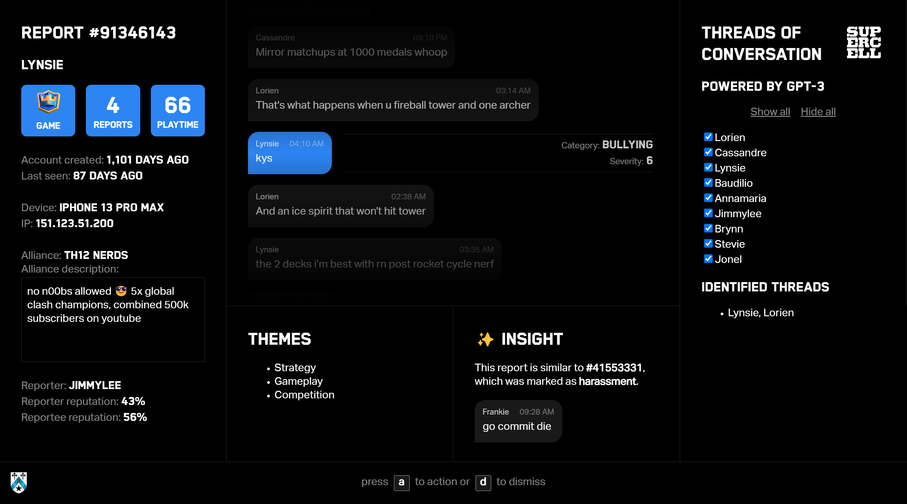

  <h3 align="center">Project Positive Vibes</h3>

  

    Using large language models to seamlessly help content moderators make better decisions, faster. 
    <a href="https://raw.githubusercontent.com/w-henderson/ProjectPositiveVibes/master/presentation.pdf"><strong>Learn More »</strong></a>
  
 

 

Project Positive Vibes introduces a new approach to content moderation: harnessing the power of modern large language models (LLMs) while staying true to the core philosophy that the human moderator is the decision-maker.

On average, Supercell’s moderators take 12 seconds to make a judgement about a report after being presented with a huge assortment of noisy signals. Our idea is simple: by minimising the noise, we can maximise the productivity of the moderation teams while improving their accuracy and access to information, which is necessary for less clear-cut cases.

Behind our sleek and intuitive user interface – which supports a broad array of keyboard shortcuts, already saving moderators a few seconds for each report – lies the heart of our project: LLMs. With the volume of research in the field exponentially increasing year upon year and recent developments such as GPT-4 taking the world by storm, exploring their potential applications to content moderation seemed the clear best approach.

A shortfall of the existing content moderation interface is that to get the whole picture of a situation, the moderator may have to read up to 100 messages per report. Using LLMs, we can identify the key themes of a conversation and present these alongside, providing invaluable context without requiring everything to be read. In addition, there may be many simultaneous conversations going on, with a substantial amount of the text provided to the moderator being irrelevant. Another model allows us to identify and isolate these individual conversations, further reducing noise and accelerating the moderation process.

Currently, once a report is dealt with, the work the moderator put into it no longer has any value. With multiple teams of moderators working around the clock, this adds up to a lot of wasted work, which could be used to inform future decisions. Our solution to this is to provide insights into how similar reports were dealt with in the past, allowing moderators to more effectively come to their conclusions. To detect these similarities, we trained a text embedding model on reported messages, which can be connected to a database of prior reports to show how those similar to the one in question were judged.

Of course, it is of the utmost importance to both Supercell and ourselves that at the end of the day, the human is the one making the decision about the future of a player within the game. While large language models can show moderators very useful information, both quantitative and qualitative, to help them understand the full context of the report, we have been careful to ensure that these insights remain only insights, and that the interface provides an easy way for the moderator to dig into the data themselves in cases where the models can’t grasp the full picture.

In conclusion, Project Positive Vibes uses insights provided by LLMs, displayed in a sleek and intuitive user interface, to allow content moderators to make better decisions, faster.

(Built during [START Hack 2023](https://www.startglobal.org/start-hack))